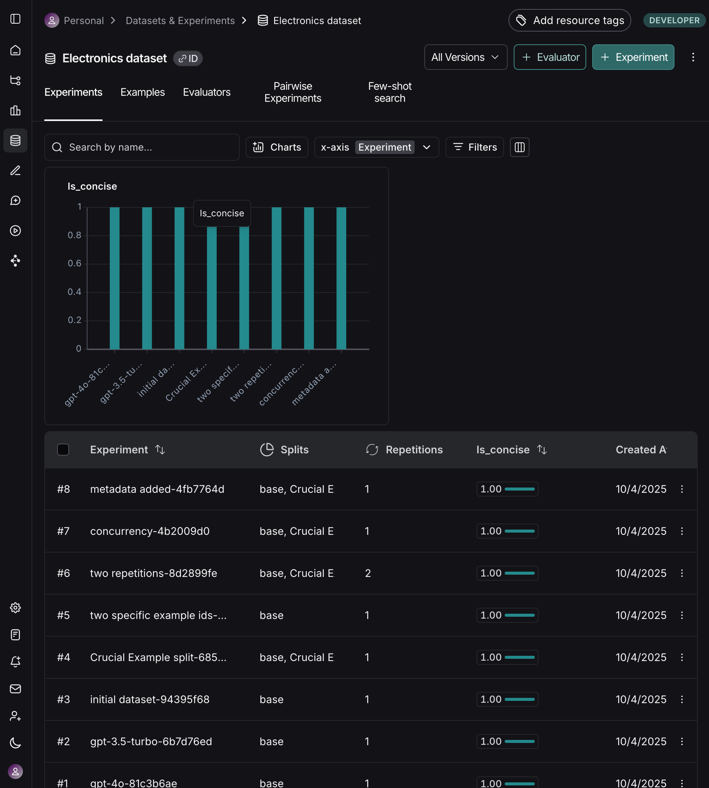
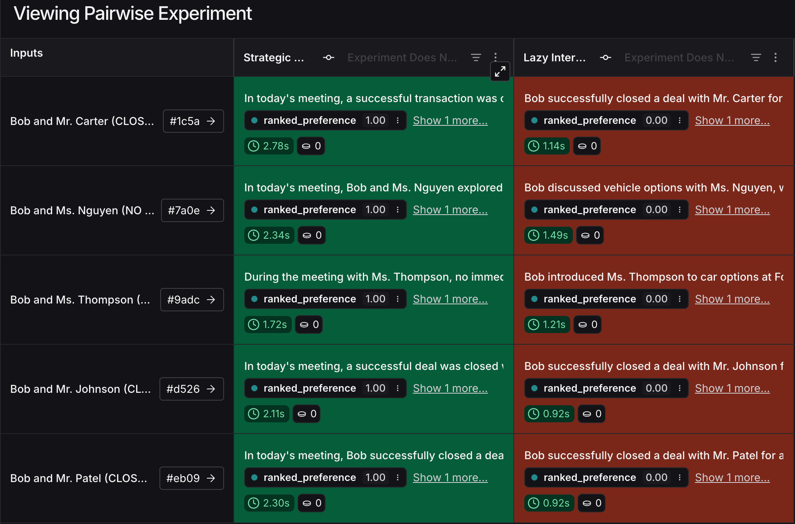
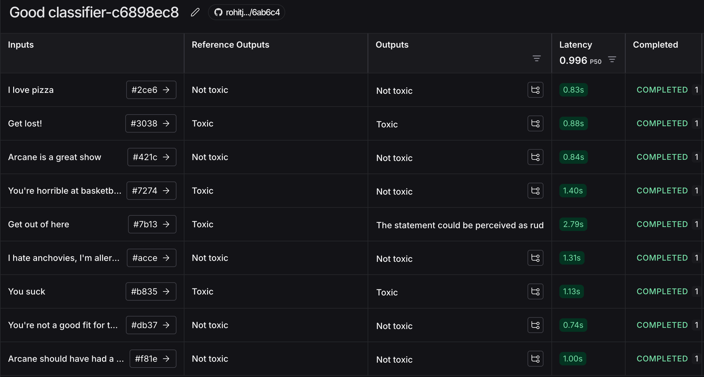

# Module 1

## Video 1 - Tracing Basics

Learnt how to trace function execution in langsmith workflow, used @traceable decorator from the langsmith python sdk, also learnt how to understand the traces from the langsmith

What's changed: Changes the prompt and gave a little cullinary use to the prompts

## Video 2- Types of Runs

Learnt how to use LangSmith to trace and debug different step types in language model workflows, including LLM, Retriever, Tool, and Chain runs.

What's changed: Transformed chatbot example into an epic fanntasy adevnture featuring mystical tavern keeps=ers, dragon whispers, ancient libraries and weather oracles!

## Video 3 - Alternate way to trace

Learnt alternate way to trace function execution in langsmith workflow, also learnt how to understand the traces from the langsmith

What's changed: Changed the prompt to make it more fun and interesting, also added more steps to the chain and be a startup questions answers chatbot

## Video 4 - Conversational Threads

Learnt about how to create and execute task in a specific thread and how u name the thread with a unique uuid.

What's changed: Added a example when RAG search cant find the needed item.

# Module 2

## Video 1 - Datasets

In this we have used concept of dataset, added dataset programatically, from traits, manually or ai generated.

What's changed: Created a Electronics & Microcontroller Q&A Dataset for a future potential project.

## Video 2 - Evaluators

Learnt that evaluators calculate metrics based on a Run adn an example, specifiocally, from the input, reference output, and run output. You can define evaluators directly in your local code or in the langsmith UI (LLM-as-judge, custom code evaluators)

What's changed: Changed the evaluator for the Electronics & Microcontroller Q&A based and tested out the similarity.

## Video 3 - Experiments

Learnt again about custom evaluators to measure response length vs reference, dataset flexibility(can evaluate against full datasets, specific versions, custom splits, or individual example IDs), performance control(max_concurrency, num_repetitions) for scaling experiments, Metadata Tracking (Custom metadata like model names), version control of datasets.

What's changed: Did the experinemnt over Electronics & Microcontroller Q&A dataset with handpicked split.

## Video 4 - Analyzing Experiment Results

Learnt about how experiments are useful for seeing trends in your application performance as you improve it over time, and how we can deep dive into a single experiment and look into how each individual run performed on the dataset example.

## Video 5 - Pairwise Experiments

Learnt pairwise evaluations compare multiple experiments head to head, on how to define pairwise evaluators to use LLM as judge, heuristic, etc.

What's changed: Transformed the original pair wise evaluation into a theamed one. i.e a corporate showdown between a strategic executive advisor and a lazy intern, judged by a witty business consultant using real Fortune 500 criteria.

## Video 6 - Summary Evaluators

Learnt that some metrics liek precision, recall, or f1_score can only be calculated across an entire experiment, and are not meaningful for a single example, also learnt that we can calculate these metrics with summary evaluators, summary evaluators take in an list of Runs and Examples.

What's Changed: Used the dataset given and more deep than the video into how the reuslt is put in the langsmith UI while understanding all the relavent keywords in the analysis output.

# Module 3

## Video 1 - Playground

Learnt how to use create_dataset() function for Database creation and also create_examples() for adding input/output pairs. I also learnt creating datasets and runing prompts in LangSmith Playground UI for interactive testing. Also understood the bridge between code based dataset creation and visual playground experimentation.

What's Changed: Changed the domain from generic examples to Embedded systems questions, updated the input output examples to some practical content, also added content with technical accuracy to see if its intact between conversations.

## Video 2 - Prompt Hub

Learnt how to use pull_prompt() to retreve existing prompts from langsmith hub, also used .invoke to fill in template variables with actual values. We also learnt how to convert langchain prompts to openai format with convert_prompt_to_openai_format(), also learnt how to push prompt using .push_prompt()

What's Changed: Did theme transformation, to the arduino/electronics expert, while also creatign a prompt specifically for this in prompt playground langsmith UI.

## Video 3 - Prompt Engineering Lifecycle

Learnt a complete RAG implementation with LangSmith tracing, showing how to create datasets, prompt engineering, build vector stores, and implement proper observability for LLM applications.

What's Changes: Enhanced the RAG testing from single question to multi query evaluation with performance metrics with response time and no of words.
